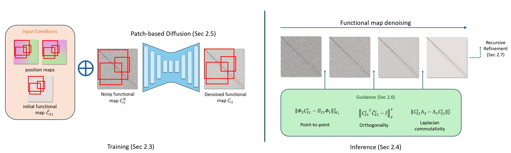

## FRIDU: Functional Map Refinement with Guided Image Diffusion



Avigail Cohen Rimon, Mirela Ben Chen, Or Litany
<br>https://onlinelibrary.wiley.com/doi/pdf/10.1111/cgf.70203 <br>

Abstract: *We propose a novel approach for refining a given correspondence map between two shapes. A correspondence map represented
as a **functional map**, namely a change of basis matrix, can be additionally treated as a **2D image**. With this perspective, we
train an image diffusion model directly in the space of functional maps, enabling it to generate accurate maps conditioned on
an inaccurate initial map. The training is done purely in the functional space, and thus is highly efficient. At inference time, we
use the pointwise map corresponding to the current functional map as guidance during the diffusion process. The guidance can
additionally encourage different functional map objectives, such as orthogonality and commutativity with the Laplace-Beltrami
operator. We show that our approach is competitive with state-of-the-art methods of map refinement and that guided diffusion
models provide a promising pathway to functional map processing.*


## Requirements

* You can use the following commands with Miniconda3 to create and activate your Python environment:
  - conda create --name fridu python=3.8
  - conda activate fridu
  - pip install torch torchvision torchaudio --index-url https://download.pytorch.org/whl/cuxxx (replace xxx by cuda version, e.g., 121)
  - pip install scipy 
  - pip install matplotlib 
  - pip install tqdm
  - pip install wandb
  - pip install polyscope
  - pip install pyfmaps

## Getting started

### Preparing datasets

Download the [TACO](https://zenodo.org/records/14066437) dataset, introduced in [TACO paper](https://boa.unimib.it/bitstream/10281/558432/1/Pedico%20et%20al-2024-STAG-VoR.pdf), and locate it under the **FRIDU/data** folder.

To generate the initial functional map based on WKS descriptors for TACO meshes, run:
```.bash
python generate_data_TACO_WKS.py
```
Note: update the data paths for offs, gt_matches, and landmarks (if used).
In our experiments, we always set k1 = k2 (resulting in a square functional map matrix).
You can use any other dataset, small adaptations might be required.

You can download the dataset used to train the "michael" model from the paper here [HuggingFace](https://huggingface.co/datasets/avigailco/FRIDU/tree/main).
Locate the **michael_pairs** folder under **FRIDU/data_processed**.

### Train FRIDU

You can train new models using `training_loop.py`. For example:
```.bash
python training_loop.py --data ../data_processed/michael_pairs --k1 128 --k2 128 --duration 2 --n_patch_res 3
```

### Inference FRIDU

You can refine functional maps with pretrained model using `generate.py`. For example:
```.bash
python generate.py --evaluate --data ../data_processed/michael_pairs --train_split 0.9 --k1 128 --k2 128 --duration 2 --n_patch_res 3
```
To perform inference on data different from the test set of the pretrained model, add the parameters:
```.bash
--external_test --external_test_data <data_path>
```
For example:
```.bash
python generate.py --evaluate --data ../data_processed/michael_pairs --train_split 0.9 --k1 128 --k2 128 --duration 2 --n_patch_res 3 --external_test --external_test_data ../data_processed/david_pairs
```
Pretrained model checkpoints are located in the **FRIDU/model_checkpoints** folder.

Note that when running training, the folder name is automatically saved as a hash of the parameters.
You can manually set it by changing the config_hash variable.
<p>
  
</p>

## Citation

```
@inproceedings{rimon2025fridu,
  title={FRIDU: Functional Map Refinement with Guided Image Diffusion},
  author={Rimon, Avigail Cohen and Ben-Chen, Mirela and Litany, Or},
  booktitle={Computer Graphics Forum},
  volume={44},
  number={5},
  pages={e70203},
  year={2025},
  organization={Wiley Online Library}
}
```

## Acknowledgments

This code is adapted from [Patch Diffusion](https://github.com/Zhendong-Wang/Patch-Diffusion) and [EDM](https://github.com/NVlabs/edm). We thank the original authors for releasing their code.
